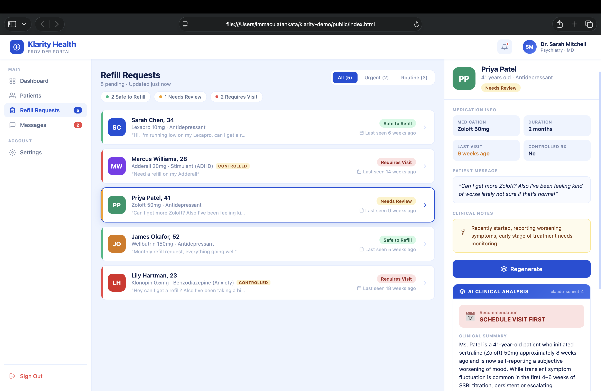

# Klarity Health — AI-Powered Refill Request Dashboard

Built solo in a 4-hour hackathon build for Klarity Health, May 2026.

**Demo video (Loom):** https://www.loom.com/share/78af8ece0e914b1dabeb69d06cb20304



> **Note on the live demo:** the frontend is a static page that can be hosted on GitHub Pages, but the AI summary feature depends on a Node/Express backend (`server.js`) that calls the Anthropic API. GitHub Pages only serves static files and can't run that backend, so the AI feature only works when the app is run locally with an API key (see below). The Loom video above walks through the full app, AI summaries included.

## What it does

A prototype provider dashboard that helps clinicians triage incoming medication refill requests. For each patient, the app sends their clinical context (medication, duration, last visit, patient message, clinical notes) to Claude, which returns a plain-English clinical summary, a recommendation (approve or schedule a visit), and a rationale grounded in the patient's specific situation.

The goal: cut down the manual chart-review work a provider does for every refill request into a single AI-assisted read.

## Tech stack

- **Backend:** Node.js, Express
- **Frontend:** Vanilla HTML/CSS/JS (no framework)
- **AI:** Anthropic API (Claude)

## Running it locally

```bash
git clone https://github.com/Ekoink/klarity-demo.git
cd klarity-demo
npm install
export ANTHROPIC_API_KEY=sk-ant-...   # your own Anthropic API key
npm start
```

Then open `http://localhost:3000`.

## How it works

- `server.js` runs an Express server with a single endpoint, `POST /api/generate-summary`, that takes a patient object and prompts Claude for a structured clinical summary, recommendation, and rationale.
- The frontend (`public/index.html`) renders a patient list and calls that endpoint to display AI-generated recommendations per patient.
- Five simulated patient profiles are included, spanning different medication categories (including controlled substances) to demonstrate differentiated triage outcomes.

## Notes

This is a hackathon prototype, not a production system. Patient data is simulated, and there's no auth or persistence layer.
